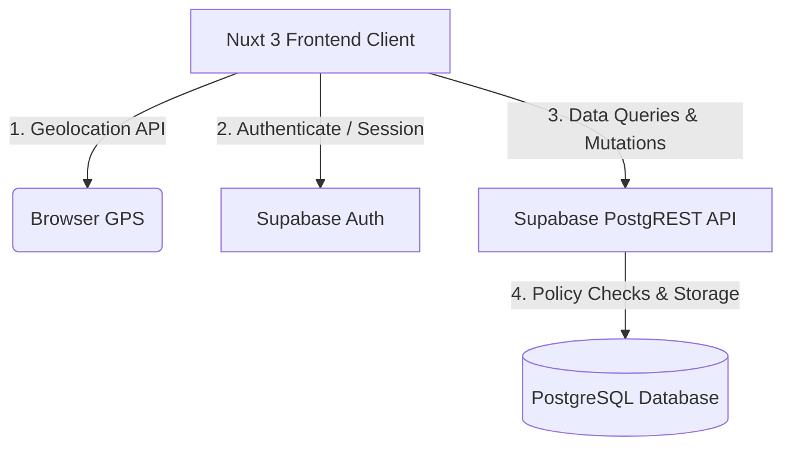
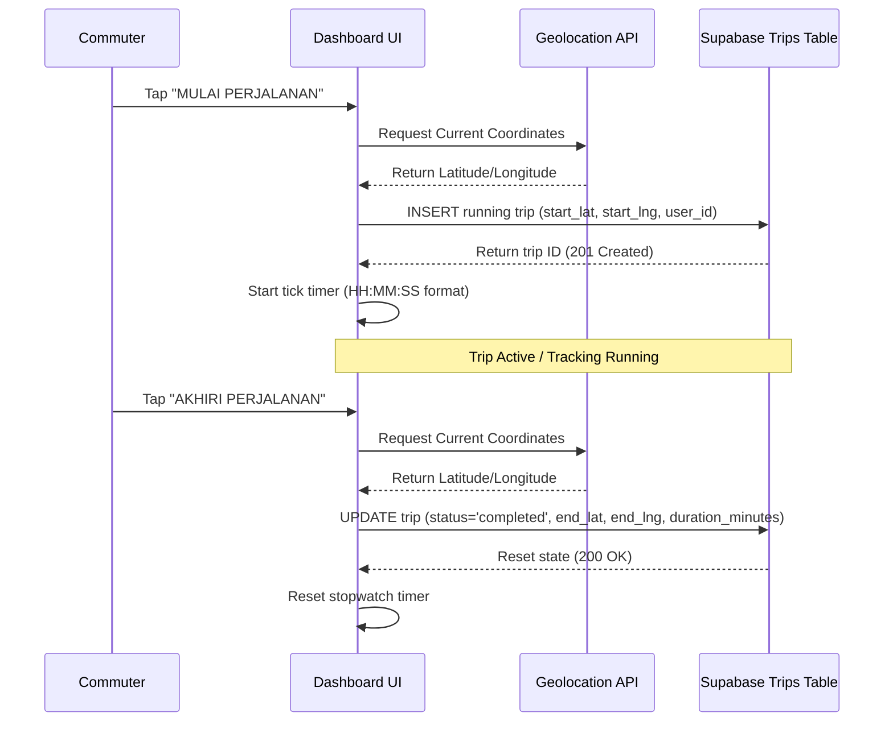

# Phorayana Core MVP Technical Integration Guide

This document details the system architecture, authentication session hydration model, database security configurations, and core features data flows for the Phorayana PWA.

---

## 1. System Architecture Overview

Phorayana is built on a modern decoupled stack: a **Nuxt 3** frontend client, native **Browser Geolocation API**, and **Supabase (PostgreSQL)** backend.



*   **Frontend**: Nuxt 3 utilizing `@nuxtjs/supabase` for client-side integration and state management.
*   **Database & API Layer**: Supabase PostgreSQL with Row Level Security (RLS) active, accessed via PostgREST.
*   **Client Location Tracking**: Native Browser Geolocation API accessed under high accuracy constraints to log journey timestamps and coordinate metrics.

---

## 2. Authentication & Session Hydration

### The Session Hydration Lifecycle
Upon page mount or reload, the `@nuxtjs/supabase` client-side plugin restores the session asynchronously. 

1.  **Initial Mount**: `useSupabaseUser()` starts as `null` or an empty state object.
2.  **JWT Verification**: The client plugin parses the browser cookie or localStorage to reconstruct the session.
3.  **Variable ID Mapping**: Depending on the session state (fresh registration/login vs. cached session reload), the user UUID might reside in `user.value.id` or the standard JWT claim field `user.value.sub`.

### The Computed `userId` Resolution
To prevent query failures due to undefined parameters, Phorayana resolves the active user ID using a computed property that bridges both payload formats:

```javascript
const userId = computed(() => user.value?.id || user.value?.sub)
```

### Session Readiness Watcher
Instead of running database queries immediately on `onMounted` (which returns empty lists if the user session has not hydrated yet), a reactive watcher monitors `userId` and triggers initial data loading once the ID is resolved:

```javascript
watch(userId, (newId) => {
  if (newId) {
    initDashboard()
  }
}, { immediate: true })
```

This architecture completely eliminates `400 Bad Request` errors caused by sending queries with `id=eq.undefined` or `user_id=eq.undefined` on initial load.

---

## 3. Database Security & RLS Policy Shift

### The PostgREST Context Mismatch
During initial deployment, configuring tables with `TO authenticated` policies caused `new row violates row-level security policy` errors on write mutations. 

*   **Root Cause**: In local Docker setups, PostgREST/Kong gateways can fail to align the database role context correctly during transaction execution, causing the current role to be resolved as `anon` or fallback roles while executing queries, making the policy evaluate to `false` even with a valid JWT.

### The Role-Agnostic Public Policy Solution
To resolve this mismatch, Phorayana RLS policies were shifted from role-scoped targets to role-agnostic (`public` target role) policies. Security is fully maintained because ownership checks are strictly enforced via the authentication context:

*   **Read Policy**: `USING (user_id = auth.uid())`
*   **Write Policy (INSERT/UPDATE)**: `WITH CHECK (user_id = auth.uid())`

Because `auth.uid()` evaluates to the token's subject UUID only when a verified JWT is sent, unauthorized/anonymous clients are securely blocked. Removing the `TO authenticated` constraint ensures PostgREST context mismatches do not block legitimate user mutations.

---

## 4. Core Features Data Flow

### A. 1-Tap Check-In & Active Trip Tracking


### B. Sticky Default Vehicle
*   **Selection**: User selects vehicle type on dashboard (motor, mobil, angkot, kereta).
*   **Database Mutation**: Upserts the selection in the `profiles` table:
    ```sql
    INSERT INTO public.profiles (id, last_vehicle_used, updated_at) 
    VALUES (userId, selectedVehicle, now())
    ON CONFLICT (id) DO UPDATE SET last_vehicle_used = EXCLUDED.last_vehicle_used, updated_at = now();
    ```
*   **Recovery**: On dashboard initialization, the profile is queried, and the selected vehicle button is highlighted.

### C. Saved Places CRUD
*   **List**: Displays user's saved locations.
*   **Insert**: Requests current Geolocation, prompts for a label (e.g. "Kantor"), and inserts a new row to `saved_places`.
*   **Delete**: Deletes by place ID and filters local reactive state:
    ```sql
    DELETE FROM public.saved_places WHERE id = placeId AND user_id = userId;
    ```
