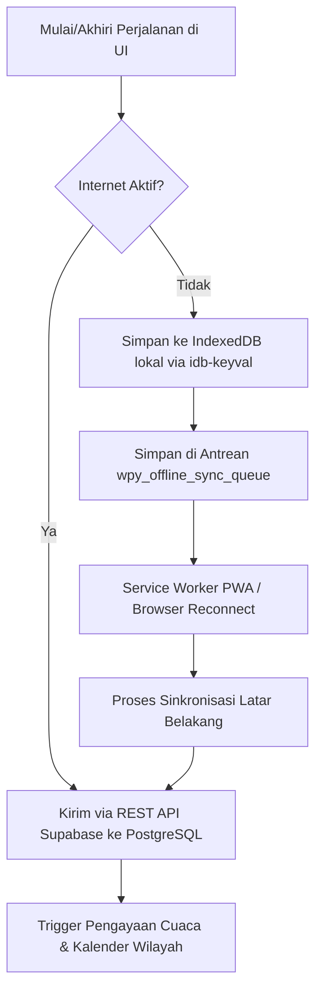
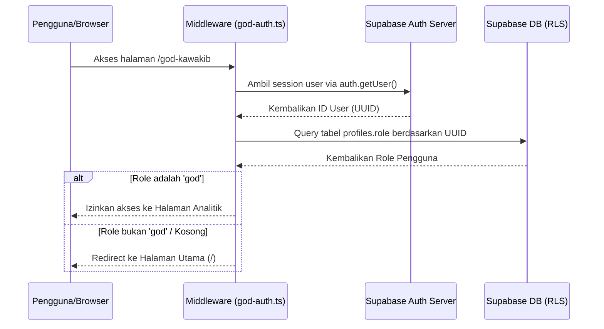

# Panduan Pemeliharaan & Handoff Developer (Phorayana)

Dokumen ini ditulis sebagai panduan pemeliharaan (maintenance) aplikasi **Phorayana** agar dapat dipahami dan dikembangkan lebih lanjut dengan aman dan terstruktur.

---

## 1. Peta Berkas (File Map)

Aplikasi Phorayana menggunakan struktur Nuxt 4 (di mana kode sumber utama berada di dalam folder `app/`). Berikut adalah berkas-berkas kunci beserta fungsinya:

| Jalur Berkas | Fungsi Singkat | Risiko Terkait | Cara Aman Mengubahnya |
| :--- | :--- | :--- | :--- |
| [`app/pages/index.vue`](file:///d:/Users/FATIH/Documents/File%20Fatih%20Kawakib%20Kartono/Portfolio/WPY/phorayana/app/pages/index.vue) | Halaman utama aplikasi (Widget 1-Tap, GPS, Deteksi Timeout, Formulir Koreksi Manual). | Kompleksitas tinggi karena menangani status sinkronisasi offline, state UI dinamis, dan validasi input. | Pecah logika ke composable luar jika kode bertambah >1500 baris. Gunakan state reaktif terpusat. |
| [`app/pages/god-kawakib.vue`](file:///d:/Users/FATIH/Documents/File%20Fatih%20Kawakib%20Kartono/Portfolio/WPY/phorayana/app/pages/god-kawakib.vue) | Dashboard analitik developer (God Mode) berbasis visualisasi data SVG anonim tanpa PII. | Potensi error hidrasi (hydration mismatch) pada grafik/klien-side metrics dan kebocoran data sensitif. | Pastikan pembungkus `<ClientOnly>` tetap digunakan. Jangan memuat kolom sensitif seperti email/nama dalam query. |
| [`app/middleware/god-auth.ts`](file:///d:/Users/FATIH/Documents/File%20Fatih%20Kawakib%20Kartono/Portfolio/WPY/phorayana/app/middleware/god-auth.ts) | Proteksi rute `/god-kawakib` agar hanya dapat diakses pengguna dengan `role = 'god'`. | Kegagalan autentikasi di sisi server (SSR) yang menyebabkan redirect loop jika menggunakan ref asinkron. | Selalu gunakan `supabase.auth.getUser()` (bukan `useSupabaseUser()`) untuk verifikasi token JWT yang sinkron. |
| [`app/utils/calendar.ts`](file:///d:/Users/FATIH/Documents/File%20Fatih%20Kawakib%20Kartono/Portfolio/WPY/phorayana/app/utils/calendar.ts) | Utilitas pencocokan tanggal perjalanan untuk pengayaan event kedaerahan Jabodetabek/hari libur. | Format input tanggal tidak valid yang dapat merusak penanggalan JavaScript (`NaN` pada Date). | Lakukan parsing defensif menggunakan pengecekan `isNaN(new Date(dateInput).getTime())` sebelum pencocokan. |
| [`nuxt.config.ts`](file:///d:/Users/FATIH/Documents/File%20Fatih%20Kawakib%20Kartono/Portfolio/WPY/phorayana/nuxt.config.ts) | Konfigurasi sistem Nuxt, Supabase Auth redirect, dan aturan Background Sync Workbox PWA. | Salah konfigurasi regex urlPattern PWA atau redirectOptions Supabase dapat memutuskan sinkronisasi latar belakang. | Selalu uji service worker secara lokal pada mode produksi (`npm run build` dan `npm run preview`) setelah mengubah konfigurasi. |
| [`supabase/migrations/`](file:///d:/Users/FATIH/Documents/File%20Fatih%20Kawakib%20Kartono/Portfolio/WPY/phorayana/supabase/migrations/) | Kumpulan berkas skema database PostgreSQL, hak akses table, kebijakan RLS, dan trigger database. | Salah modifikasi migrasi sql dapat menyebabkan error sinkronisasi skema database lokal dan produksi. | Buat berkas migrasi baru ber-timestamp menggunakan `npx supabase migration new <nama_migrasi>` daripada mengubah berkas lama. |

---

## 2. Alur Data (Data Flow)

Alur pencatatan perjalanan dirancang dengan arsitektur **Offline-First**.



### Detil Teknis & Cara Aman Mengubah:
*   **Berkas Terkait**: [index.vue](file:///d:/Users/FATIH/Documents/File%20Fatih%20Kawakib%20Kartono/Portfolio/WPY/phorayana/app/pages/index.vue) (fungsi `endTrip` & `submitManualFix`), [nuxt.config.ts](file:///d:/Users/FATIH/Documents/File%20Fatih%20Kawakib%20Kartono/Portfolio/WPY/phorayana/nuxt.config.ts) (Workbox caching & background sync).
*   **Risiko**: Saat data reaktif Vue (seperti Proxy/Ref) dikirim langsung ke IndexedDB, browser memicu `DataCloneError`.
*   **Cara Aman Mengubah**: Sebelum menyimpan payload ke IndexedDB atau antrean lokal, ubah data tersebut menjadi objek mentah JavaScript (raw object) menggunakan `JSON.parse(JSON.stringify(payload))`.

---

## 3. Alur Autentikasi & Keamanan (Auth Flow)

Sistem autentikasi menggunakan **Supabase Auth** terintegrasi dengan **Row Level Security (RLS)** PostgreSQL di sisi server database.



### Detil Teknis & Cara Aman Mengubah:
*   **Berkas Terkait**: [god-auth.ts](file:///d:/Users/FATIH/Documents/File%20Fatih%20Kawakib%20Kartono/Portfolio/WPY/phorayana/app/middleware/god-auth.ts) dan [20260720162500_protect_profiles.sql](file:///d:/Users/FATIH/Documents/File%20Fatih%20Kawakib%20Kartono/Portfolio/WPY/phorayana/supabase/migrations/20260720162500_protect_profiles.sql).
*   **Risiko**: Escalation privilege (pengguna mengubah role dirinya sendiri menjadi 'god' secara langsung dari browser client).
*   **Cara Aman Mengubah**: Jangan pernah menghapus trigger database `trg_protect_profile_role` yang melindungi perubahan kolom `role` di sisi PostgreSQL. Jika ingin memberikan akses pengembang baru, daftarkan UUID pengguna tersebut secara langsung melalui migration script lokal atau dasbor administrator Supabase.

---

## 4. Peta Risiko (Risk Map)

Berikut adalah beberapa skenario kegagalan sistem yang harus diwaspadai:

### A. Data Hilang karena Kuota Habis / Sinyal Terputus
*   **Dampak**: Perjalanan pengguna gagal terkirim ke server database Supabase.
*   **Mitigasi**: Aplikasi secara otomatis menyalin data perjalanan yang gagal ke IndexedDB lokal.
*   **Cara Menguji**: Matikan koneksi jaringan pada browser inspector (mode Offline), lakukan check-out perjalanan, lalu nyalakan kembali koneksi jaringan untuk memastikan antrean berhasil dikirim tanpa kehilangan entri.

### B. Mismatch Hidrasi (Hydration Mismatch) pada Grafik
*   **Dampak**: Tampilan grafik/chart pada God Mode berantakan atau gagal render dengan status error di konsol.
*   **Mitigasi**: Seluruh visualisasi grafik SVG dibungkus dengan komponen `<ClientOnly>`.
*   **Cara Menguji**: Hard reload halaman `/god-kawakib` dan periksa tab Console pada Developer Tools untuk memastikan tidak ada pesan error merah bertuliskan *Hydration Mismatch*.

### C. Masalah Ketergantungan (Dependency Bloat)
*   **Dampak**: Ukuran bundel aplikasi membengkak yang memperlambat pemuatan halaman di ponsel commuter.
*   **Mitigasi**: Phorayana mematuhi prinsip **stdlib-first** (menggunakan fitur bawaan browser/bahasa pemrograman daripada pustaka eksternal). Contoh: Grafik divisualisasikan dengan render langsung elemen `<svg>` Vue, bukan pustaka grafik pihak ketiga yang berat.

---

## 5. Panduan Modifikasi Fitur (Change Guide)

Ikuti langkah-langkah terstruktur berikut ketika Anda ingin menambahkan atau mengubah fitur:

### Langkah 1: Update Database Skema (Lokal)
Jika Anda membutuhkan kolom baru (misalnya koordinat kecepatan rata-rata perjalanan):
1. Buat berkas migrasi SQL baru secara lokal:
   ```bash
   npx supabase migration new tambah_kolom_kecepatan
   ```
2. Isi berkas SQL baru tersebut dengan pernyataan modifikasi kolom (misal: `ALTER TABLE public.trips ADD COLUMN average_speed NUMERIC;`).
3. Terapkan migrasi tersebut ke server database Supabase lokal Anda:
   ```bash
   npx supabase db push --local
   ```

### Langkah 2: Sesuaikan Utilitas Aplikasi
Sesuaikan logika helper pendukung data pada folder `app/utils/` untuk memproses properti data yang baru. Buat unit test sederhana atau pastikan kode helper bersifat defensif (selalu memvalidasi null safety).

### Langkah 3: Update Halaman UI & Offline Engine
1. Tambahkan input field atau bind value baru tersebut pada berkas halaman terkait.
2. Pastikan properti baru ditambahkan ke antrean data cadangan IndexedDB di berkas [index.vue](file:///d:/Users/FATIH/Documents/File%20Fatih%20Kawakib%20Kartono/Portfolio/WPY/phorayana/app/pages/index.vue).

### Langkah 4: Pengujian & Gated Commit
1. Jalankan server lokal: `npm run dev`.
2. Gunakan Web Inspector untuk memverifikasi fungsionalitas:
   * Tes online flow (data masuk ke Supabase).
   * Tes offline flow (data mengantre di IndexedDB).
   * Cek konsol devtools untuk memastikan tidak ada error.
3. Commit perubahan menggunakan format commit konvensional:
   ```bash
   git add -A
   git commit -m "feat: [deskripsi ringkas perubahan Anda]"
   git push origin main
   ```
