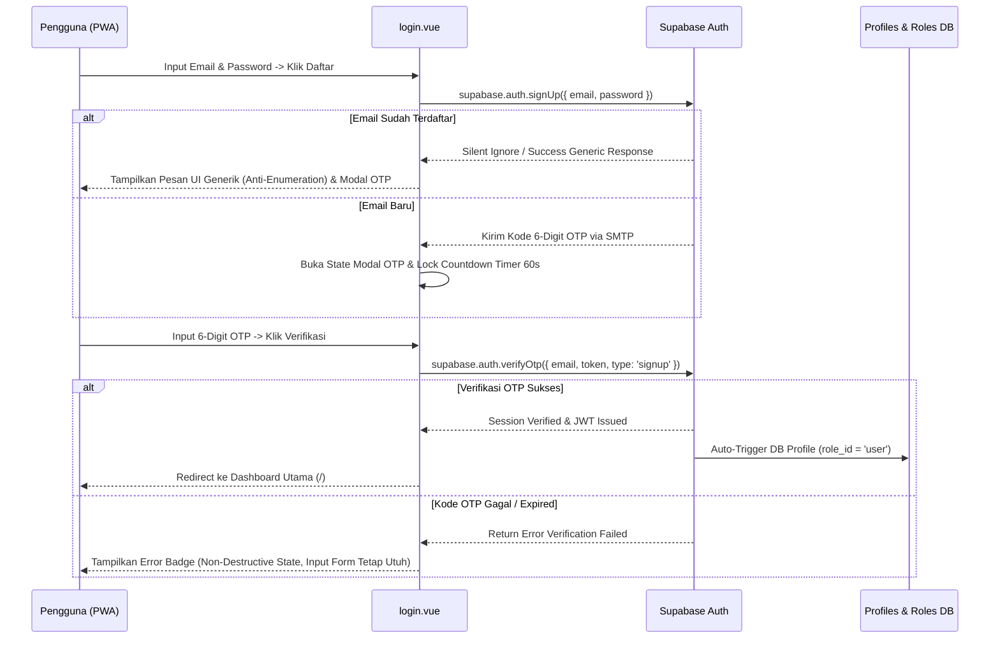

# Spesifikasi Arsitektur & Roadmap: RBAC Roles Clean, Master Identity, & Email OTP Registration

Dokumen ini mendokumentasikan spesifikasi teknis dan alur implementasi persiapan refactoring sistem autentikasi, manajemen peranan berbasis peran (RBAC), serta pendaftaran berbasis Email OTP pada aplikasi **Phorayana**.

---

## 1. Task 1: Pembersihan Skema & Tabel Roles Baru (RBAC Clean Migration)

### 1.1. Tujuan
Memindahkan model peranan dari kolom string tunggal `role` pada tabel `public.profiles` ke struktur **Role-Based Access Control (RBAC)** teratur menggunakan tabel master `public.roles`.

### 1.2. Spesifikasi Skema Database

#### Tabel Master `public.roles`
```sql
CREATE TABLE public.roles (
  id UUID PRIMARY KEY DEFAULT gen_random_uuid(),
  name TEXT UNIQUE NOT NULL CHECK (name IN ('god', 'user')),
  description TEXT,
  created_at TIMESTAMP WITH TIME ZONE DEFAULT timezone('utc'::text, now()) NOT NULL
);

-- Seed Initial Roles:
-- 1. 'god'  -> Master Admin / Developer Access (Akses Penuh God Mode /god-kawakib)
-- 2. 'user' -> Standard Commuter User (Akses Pengguna Biasa)
```

#### Tabel `public.profiles` (Relasional FK)
```sql
CREATE TABLE public.profiles (
  id UUID REFERENCES auth.users ON DELETE CASCADE PRIMARY KEY,
  updated_at TIMESTAMP WITH TIME ZONE,
  full_name TEXT,
  last_vehicle_used TEXT DEFAULT 'motor',
  role_id UUID REFERENCES public.roles(id) NOT NULL
);
```

### 1.3. Strategi Clean Migration (Zero Legacy Debt)
- **Penghapusan Kolom Legacy**: Kolom `role TEXT` pada `public.profiles` di-drop secara menyeluruh.
- **Penghapusan Trigger Legacy**: Fungsi `public.protect_profile_role()` dan trigger `trg_protect_profile_role` di-drop total dari PostgreSQL.
- **Relasi Foreign Key**: Hak akses pengguna ditentukan secara ketat melalui `profiles.role_id` yang merujuk pada `roles.id`.

---

## 2. Task 2: Pembaruan Master Admin / God Identity Seeding

### 2.1. Tujuan
Menghapus referensi akun testing dummy legacy (seperti `testuser@example.com`) dari dokumentasi dan skema migrasi, serta menetapkan spesifikasi seeding akun Master Developer secara aman.

### 2.2. Spesifikasi Kredensial & Profile Seed
- **Metode Enkripsi**: Kredensial akun master di-hash di sisi server Supabase Auth menggunakan ekstensi `pgcrypto` (`extensions.crypt`).
- **Profile Seed**: Akun master developer didaftarkan dengan nama profil khusus ("Master Developer") dan `role_id` yang terikat langsung ke ID role `'god'` pada `public.roles`.
- **Aturan Keamanan Dokumen**: DILARANG keras menuliskan string plain-text password sensitif di dalam berkas dokumentasi maupun kode sumber repositori.

---

## 3. Task 3: Spesifikasi Fitur Email OTP Registration (PWA Ready)

### 3.1. Alur Registrasi Email OTP & Fail-Safe State Machine (`verifyOtp`)
Proses pendaftaran pengguna baru dirombak menjadi alur verifikasi 2-tahap yang aman dari serangan enumerasi dan kegagalan penanganan error:



### 3.2. Spesifikasi State UI & Safe Handling Strategy pada `login.vue`
1. **Form Registrasi & Sanitasi Input**: 
   - Field Email & Password standar dengan sanitasi otomatis regex `.replace(/\D/g, '')` pada input 6-digit OTP dan *slice* 6 karakter.
2. **State Modal 6-Digit OTP**: 
   - Modal/Panel Input khusus 6-digit pin code dengan *auto-focus*.
   - Fitur **Countdown Timer 60 Detik** (`resendTimer`) untuk throttling tombol "Kirim Ulang OTP".
3. **Fail-Safe & Anti-Enumeration Rules**:
   - **Anti-User Enumeration**: Pesan UI selalu generik untuk menyamarkan apakah email sudah terdaftar.
   - **Non-Destructive Error Recovery**: Error OTP tidak menghapus data form registrasi maupun modal input.
   - **Auto-Provisioning Profile Trigger**: Memanfaatkan trigger PostgreSQL `on_auth_user_created` untuk menjamin atomisitas pembuatan baris profil di `public.profiles`.

---

## 4. Rencana Langkah Eksekusi Teknis (Pending Konfirmasi)

1. **Migrasi Database Supabase**: Membuat script migrasi SQL baru untuk tabel `public.roles`, pembersihan kolom `role` & trigger lama, serta seeding master account.
2. **Pembaruan Backend Middleware (`god-auth.ts`)**: Mengubah query middleware untuk mengecek peranan via JOIN relasi `profiles.role_id` -> `roles.name`.
3. **Pembaruan Komponen UI (`login.vue`)**: Mengimplementasikan modal OTP 6-digit dengan countdown timer 60s dan fungsi `verifyOtp`.
