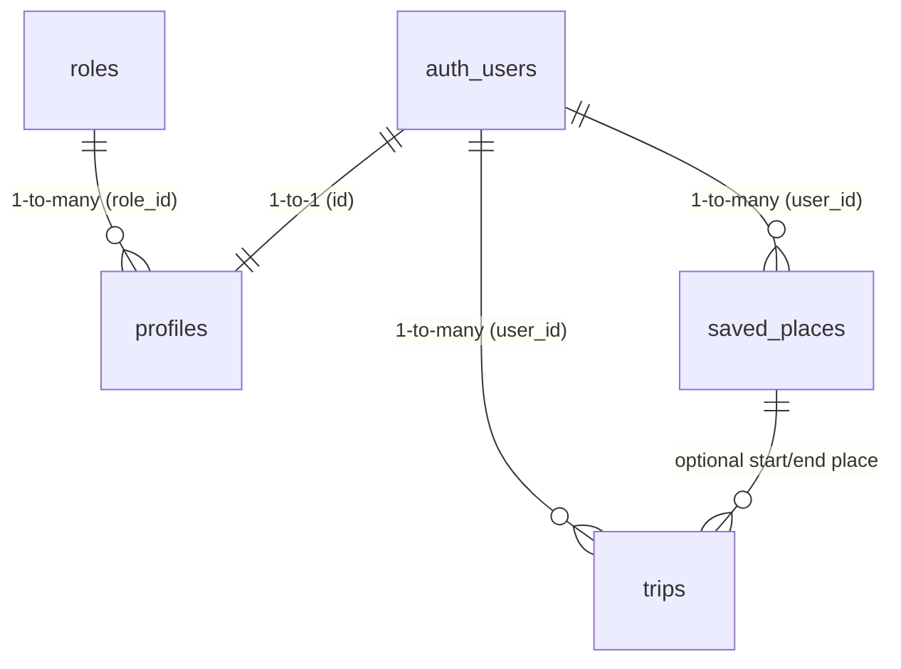

# Dokumentasi Skema Database & RBAC (Phorayana)

Dokumen ini berisi spesifikasi skema PostgreSQL, struktur relasi RBAC, kebijakan Row Level Security (RLS), dan panduan migrasi Supabase untuk aplikasi Phorayana.

---

## 1. ERD & Struktur Relasi Tabel



---

## 2. Definisi Skema Tabel

### 2.1. Tabel `public.roles` (RBAC Master)
Tabel terpisah untuk mengelola peranan akses pengguna dalam sistem.
```sql
CREATE TABLE public.roles (
  id UUID PRIMARY KEY DEFAULT gen_random_uuid(),
  name TEXT UNIQUE NOT NULL CHECK (name IN ('god', 'user')),
  description TEXT,
  created_at TIMESTAMP WITH TIME ZONE DEFAULT timezone('utc'::text, now()) NOT NULL
);

-- Seed Initial Roles:
-- 1. 'god'  -> Master Admin / Developer Access (akses penuh /god-kawakib)
-- 2. 'user' -> Standard Commuter User (akses pengguna umum)
```

### 2.2. Tabel `public.profiles`
Menyimpan data preferensi pengguna dan relasi peranan.
```sql
CREATE TABLE public.profiles (
  id UUID REFERENCES auth.users ON DELETE CASCADE PRIMARY KEY,
  updated_at TIMESTAMP WITH TIME ZONE,
  full_name TEXT,
  last_vehicle_used TEXT DEFAULT 'motor',
  role_id UUID REFERENCES public.roles(id) NOT NULL
);
```
> [!NOTE]
> **Pembersihan RBAC Clean**: Kolom string legacy `role` dan trigger legacy `trg_protect_profile_role` telah di-drop sepenuhnya. Hak akses pengguna kini diatur secara terstruktur melalui `role_id`.

### 2.3. Tabel `public.saved_places`
Menyimpan lokasi langganan pengguna (Rumah, Kampus, Kantor, dll).
```sql
CREATE TABLE public.saved_places (
  id BIGINT GENERATED BY DEFAULT AS IDENTITY PRIMARY KEY,
  user_id UUID REFERENCES auth.users ON DELETE CASCADE NOT NULL,
  place_name TEXT NOT NULL,
  latitude DOUBLE PRECISION NOT NULL,
  longitude DOUBLE PRECISION NOT NULL,
  created_at TIMESTAMP WITH TIME ZONE DEFAULT timezone('utc'::text, now()) NOT NULL
);
```

### 2.4. Tabel `public.trips` (Core Data Log)
Tabel utama pencatatan perjalanan commuters.
```sql
CREATE TABLE public.trips (
  id BIGINT GENERATED BY DEFAULT AS IDENTITY PRIMARY KEY,
  user_id UUID REFERENCES auth.users ON DELETE CASCADE NOT NULL,
  vehicle_type TEXT NOT NULL,
  start_time TIMESTAMP WITH TIME ZONE NOT NULL,
  end_time TIMESTAMP WITH TIME ZONE,
  start_lat DOUBLE PRECISION NOT NULL,
  start_lng DOUBLE PRECISION NOT NULL,
  end_lat DOUBLE PRECISION,
  end_lng DOUBLE PRECISION,
  start_place_id BIGINT REFERENCES public.saved_places(id),
  end_place_id BIGINT REFERENCES public.saved_places(id),
  duration_minutes INTEGER,
  weather_condition TEXT,
  regional_event TEXT,
  status TEXT DEFAULT 'running' CHECK (status IN ('running', 'completed', 'timeout', 'manual_fix')),
  created_at TIMESTAMP WITH TIME ZONE DEFAULT timezone('utc'::text, now()) NOT NULL
);
```

---

## 3. Kebijakan Row Level Security (RLS)
Seluruh tabel dilindungi oleh RLS berbasis autentikasi `auth.uid()` untuk mengisolasi data antar pengguna:
- **`saved_places`**: `USING (user_id = auth.uid())` & `WITH CHECK (user_id = auth.uid())`
- **`trips`**: `USING (user_id = auth.uid())` & `WITH CHECK (user_id = auth.uid())`
- **`profiles`**: `USING (id = auth.uid())`
