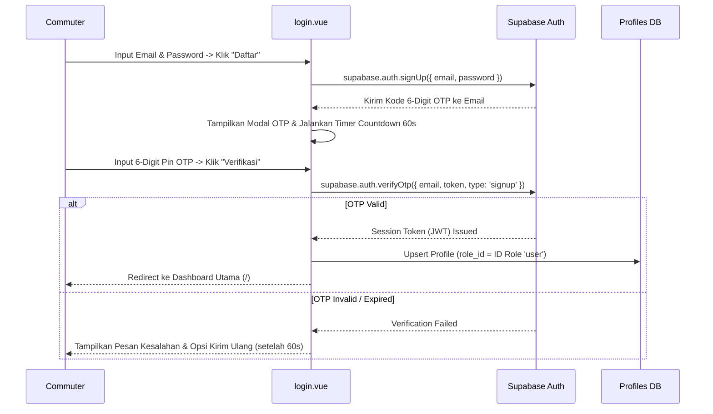

# Spesifikasi Fitur: Email OTP Registration & Autentikasi

Dokumen ini mendeskripsikan spesifikasi teknis dan alur pengguna untuk fitur pendaftaran akun berbasis 6-Digit Email OTP (`verifyOtp`) serta kontrol akses pengguna pada aplikasi Phorayana.

---

## 1. Alur Pendaftaran (Email OTP)

---

## 2. Spesifikasi Antarmuka UI (`login.vue`)

1. **Modal State Verification**:
   - Modal OTP muncul otomatis setelah request `signUp` berhasil disetujui server.
   - Menyediakan 6-digit PIN input field dengan auto-focus.
2. **Countdown Timer 60 Detik**:
   - Timer countdown 60 detik (`resendTimer`) mencegah spam request pengiriman ulang OTP.
   - Tombol "Kirim Ulang OTP" nonaktif (*disabled*) selama timer berjalan.
3. **Default Role Assignment**:
   - Setiap pengguna baru yang menyelesaikan `verifyOtp` otomatis dibuatkan baris profil dengan `role_id` merujuk ke peranan `'user'`.

---

## 3. Edge-Case & Anti-Break Handling Strategy

### 3.1. Anti-User Enumeration
- **Pesan UI Generik**: Untuk mencegah penyerang melakukan sniffing/probing terhadap email terdaftar, sistem selalu menampilkan pesan sukses yang netral:  
  *"Jika email Anda belum terdaftar, kami telah mengirimkan kode 6-digit OTP ke email Anda."*
- **Perlindungan Privasi**: Sistem tidak pernah membocorkan pesan error eksplisit seperti *"Email sudah terdaftar"* atau *"Email tidak ditemukan"* pada alur pendaftaran.

### 3.2. Resource Protection (Silent-Ignore Scheme)
- Jika email yang diinputkan pengguna ternyata sudah ada pada database `auth.users`, sistem menjalankan skema *silent-ignore*: UI menampilkan respons sukses generik tanpa memicu panggilan pengiriman SMTP email OTP baru. Ini melindungi kuota SMTP dan mencegah spamming email.

### 3.3. Non-Destructive Error Recovery
- Jika kode OTP yang dimasukkan pengguna salah atau kedaluwarsa (*expired*), pesan kesalahan (*error badge*) ditampilkan dengan jelas di dalam modal OTP.
- **State Preservation**: Input form registrasi dan nilai modal OTP tidak direset atau dihapus secara destruktif, sehingga pengguna cukup mengoreksi digit angka tanpa mengulang input dari awal.

### 3.4. Input Sanitization & Masking
- **Auto-Sanitizing**: Nilai input OTP 6-digit disanitasi secara real-time via regex `.replace(/\D/g, '')` untuk memastikan hanya karakter numerik (0–9) yang diterima.
- **Max-Length Truncation**: Event typing dan paste (*event.clipboardData*) dipotong otomatis maksimal 6 karakter (`.slice(0, 6)`).

### 3.5. UI Loading Lock & Throttling Rate-Limit
- **Loading State Lock**: Seluruh elemen tombol dan input pada modal dikunci (*disabled*) dalam status *loading* selama proses verifikasi `verifyOtp` berjalan.
- **Resend Throttling**: Tombol *"Kirim Ulang OTP"* dikunci dengan timer countdown 60 detik (`resendTimer`) guna mematuhi batas *rate-limit* Supabase Auth.
