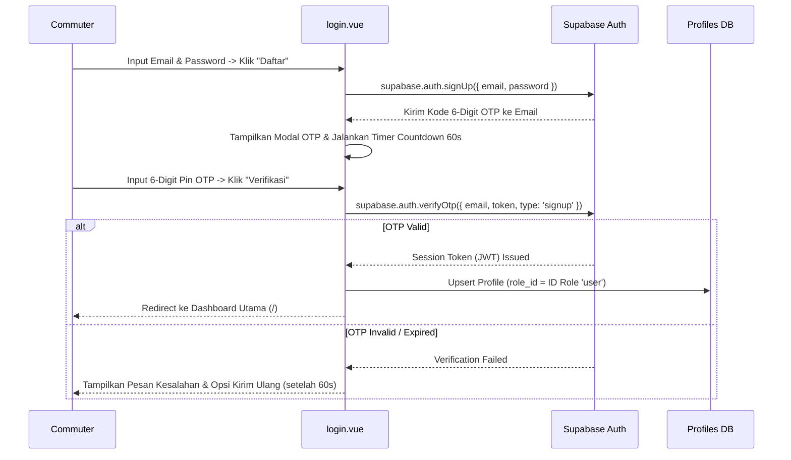

# Spesifikasi Fitur: Email OTP Registration & Autentikasi

Dokumen ini mendeskripsikan spesifikasi teknis dan alur pengguna untuk fitur pendaftaran akun berbasis 6-Digit Email OTP (`verifyOtp`) serta kontrol akses pengguna pada aplikasi Phorayana.

---

## 1. Alur Pendaftaran (Email OTP)

---

## 2. Spesifikasi Antarmuka UI (`login.vue`)

1. **Modal State Verification**:
   - Modal OTP muncul otomatis setelah request `signUp` berhasil disetujui server.
   - Menyediakan 6-digit PIN input field dengan auto-focus.
2. **Countdown Timer 60 Detik**:
   - Timer countdown 60 detik (`resendTimer`) mencegah spam request pengiriman ulang OTP.
   - Tombol "Kirim Ulang OTP" nonaktif (*disabled*) selama timer berjalan.
3. **Default Role Assignment**:
   - Setiap pengguna baru yang menyelesaikan `verifyOtp` otomatis dibuatkan baris profil dengan `role_id` merujuk ke peranan `'user'`.
