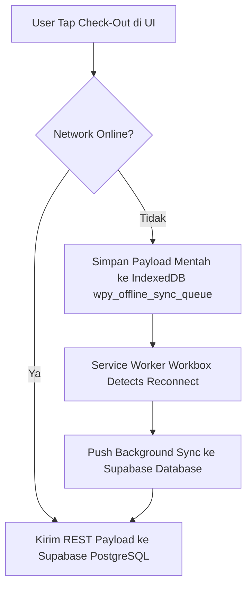

# Spesifikasi Fitur: 1-Tap Check-In & Engine Synchronizer Offline-First

Dokumen ini menjelaskan mekanisme kerja tombol utama 1-Tap Check-In, pengelolaan kendaraan (*sticky vehicle*), serta penanganan data luring (offline) berbasis Service Worker dan IndexedDB.

---

## 1. Transisi State Widget 1-Tap

- **Idle (Siap Jalan)**: Tombol makro berwarna *Phorayana Red* (`#d53734`) bertuliskan **"Mulai Perjalanan"**.
- **Running (Dalam Perjalanan)**: Tombol bertransisi ke warna *Soft Terracotta* (`#d4896a`) bertuliskan **"Saya Sudah Sampai"** dilengkapi timer stopwatch real-time `HH:MM:SS`.
- **Completed**: Menampilkan kartu ringkasan durasi perjalanan dan pengayaan cuaca otomatis.

---

## 2. Offline-First Sync Engine (PWA)

1. **Penyimpanan Lokal**: Jika `navigator.onLine` bernilai `false`, payload dikonversi menjadi raw JS object (`JSON.parse(JSON.stringify(payload))`) untuk mencegah `DataCloneError`, kemudian disimpan di IndexedDB.
2. **Background Sync**: Service Worker (`@vite-pwa/nuxt`) memantau status jaringan dan menyinkronkan antrean ke database saat koneksi pulih secara hening (*silent background sync*).
