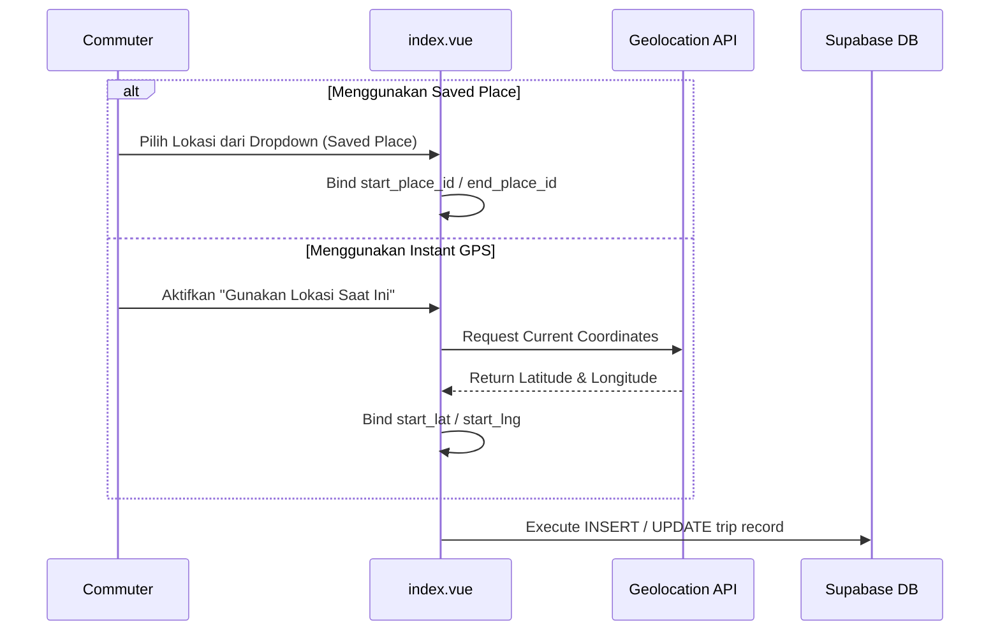

# Spesifikasi Fitur: Multi-Location, Instant GPS Capture & Saved Places

Dokumen ini mendeskripsikan spesifikasi teknis dan alur penanganan lokasi pada aplikasi Phorayana, mencakup penangkapan koordinat Geolocation real-time dan manajemen lokasi langganan (Saved Places CRUD).

---

## 1. Modus Penangkapan Lokasi

### 1.1. Saved Places (Lokasi Terdaftar)
Pengguna dapat mendaftarkan lokasi yang sering dikunjungi (Rumah, Kampus, Kantor, Kafe) ke tabel `public.saved_places`.
- **Penggunaan di UI**: Lokasi ini muncul dalam pilihan *quick dropdown* pada formulir utama `app/pages/index.vue`.
- **Aturan RLS**: Pengguna hanya dapat membaca, menambah, dan menghapus lokasi miliknya sendiri (`user_id = auth.uid()`).

### 1.2. Instant GPS Capture (Lokasi Insidental)
Untuk lokasi sekali pakai yang tidak didaftarkan:
- Pengguna mengaktifkan opsi *"Gunakan Lokasi Saat Ini"*.
- Aplikasi memanggil **Browser Geolocation API** (`navigator.geolocation.getCurrentPosition`) dengan opsi `enableHighAccuracy: true`.
- Koordinat latitude dan longitude ditangkap secara otomatis saat pengguna menekan tombol "Mulai Jalan" atau "Saya Sudah Sampai".

---

## 2. Diagram Alur Penanganan Lokasi

