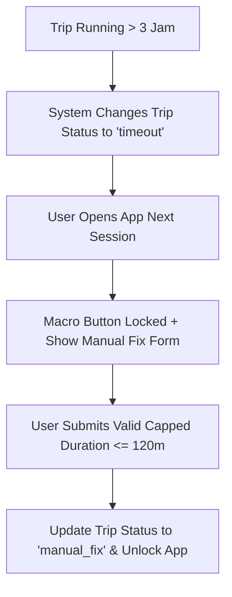

# Spesifikasi Fitur: Forgotten Checkout Handler (Auto-Timeout & Manual Fix Recovery)

Dokumen ini menjelaskan logika penanganan perjalanan yang lupa diakhiri oleh pengguna, mekanisme penguncian otomatis (auto-timeout), serta alur pemulihan (*Manual Fix Recovery*).

---

## 1. Auto-Timeout Handler (Batas Waktu 3 Jam)

Untuk mencegah data abnormal masuk ke sistem *big data*:
- Jika sebuah perjalanan berada dalam status `running` melebihi ambang batas waktu (default: **3 jam / 180 menit**), backend secara otomatis mengunci status perjalanan menjadi `timeout`.
- Perjalanan berstatus `timeout` dihentikan pencatatan durasi waktunya dan ditandai membutuhkan penyesuaian dari pengguna.

---

## 2. Formulir Pemulihan Koreksi Manual (Manual Fix)

Ketika pengguna membuka aplikasi setelah terjadi `timeout`:
1. **Penguncian UI**: Tombol makro *"Mulai Perjalanan"* dikunci (*disabled*) untuk mencegah perjalanan baru dimulai sebelum perjalanan sebelumnya diselesaikan.
2. **Formulir Koreksi Manual**: Tampilan UI menyajikan formulir koreksi terbatas:
   > *"Kamu lupa mengakhiri perjalanan sebelumnya. Masukkan durasi riil perjalananmu (Maksimal 120 menit):"*
3. **Pembatasan Input (Strict Cap)**: Durasi input dibatasi maksimal 120 menit untuk menjaga integritas ekosistem data komunal.
4. **Pembaruan State**: Setelah pengguna mengirimkan durasi koreksi, status perjalanan diperbarui dari `timeout` menjadi `manual_fix`.

