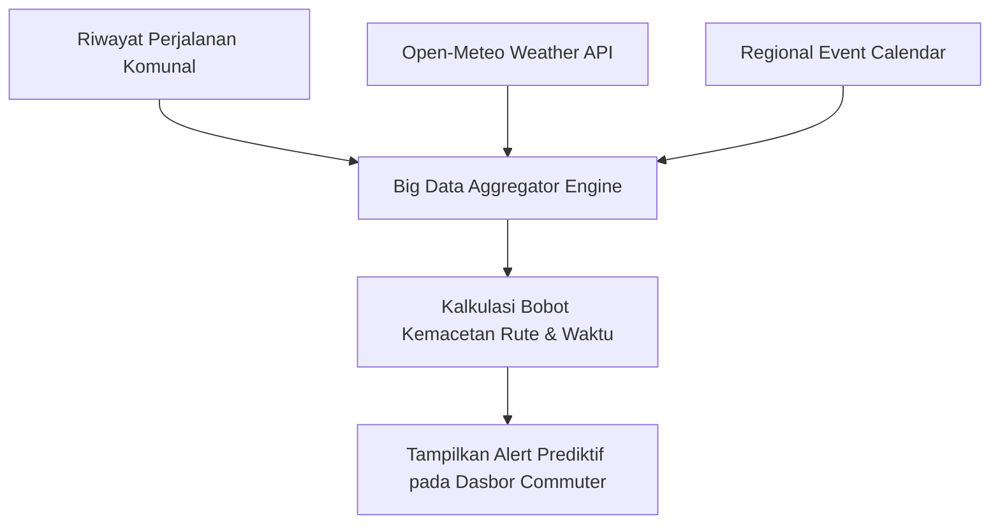

# Spesifikasi Fitur: Contextual Big Data Engine & Alert Prediksi Kemacetan

Dokumen ini mendeskripsikan arsitektur kecerdasan server-side Phorayana yang menggabungkan riwayat perjalanan komunal dengan pengayaan cuaca otomatis (*Open-Meteo API*) dan kalender event kedaerahan.

---

## 1. Komponen Pengayaan Data (Data Enrichment)

### 1.1. Integrasi Cuaca Otomatis (Open-Meteo API)
Setiap kali pengguna menekan tombol *"Saya Sudah Sampai"*, sistem serverless/Nitro secara otomatis memicu pemanggilan API cuaca gratis **Open-Meteo API** berdasarkan koordinat GPS tujuan dan waktu kedatangan.
- Menyimpan kondisi cuaca (misal: *Cerah*, *Hujan Ringan*, *Hujan Lebat*) ke kolom `weather_condition` pada tabel `public.trips`.

### 1.2. Pencocokan Kalender Event Kedaerahan (`app/utils/calendar.ts`)
Sistem mencocokkan tanggal perjalanan dengan kalender event kedaerahan Jabodetabek dan hari libur nasional (misal: HUT Bogor, Cap Go Meh, Hari Libur Nasional).
- Menyimpan nama event ke kolom `regional_event` pada tabel `public.trips`.

---

## 2. Engine Prediksi Kemacetan Komunal

- **Output Alert**: Menampilkan rekomendasi prediktif pada dasbor utama pengguna, contoh:
  > *"Rute ini terdeteksi melambat 2.5x lipat pada hari Selasa jam 07:00–07:30 berdasarkan 12 riwayat perjalanan terakhir di komunitas."*
